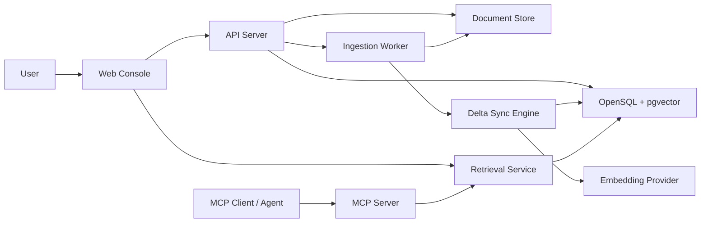
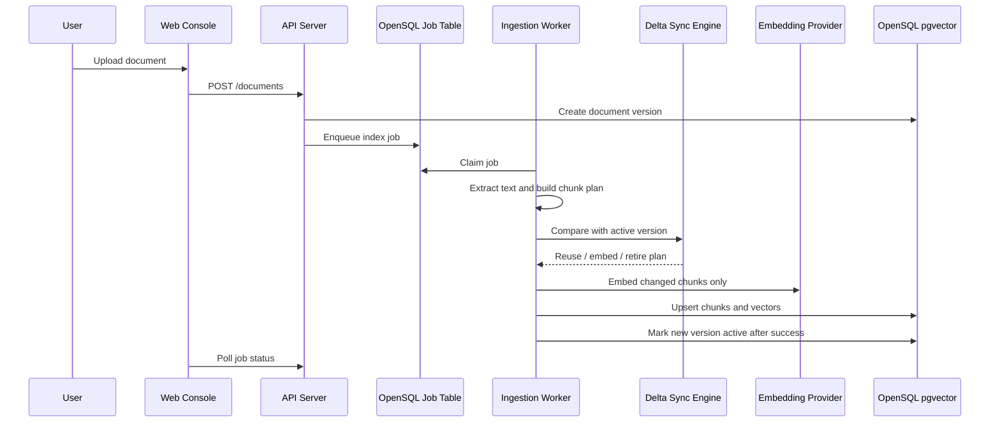

# OpenSQL AutoRAG Sync Architecture Design

## 1. Direction

OpenSQL AutoRAG Sync is a product-led AI document search platform built around OpenSQL and pgvector. The user-facing story is simple: upload documents, let the platform extract and index knowledge, then search the latest version through an MCP-compatible interface. The technical differentiator is the Delta Sync Engine, which detects changed document regions and re-embeds only affected chunks instead of rebuilding the whole vector index.

The selected architecture follows the contest direction while keeping the implementation focused enough for a polished submission:

- Primary story: OpenSQL as an operational AI document database.
- Core differentiator: changed-chunk synchronization and version-aware retrieval.
- Product surface: web console, ingestion API, background worker, retrieval API, and MCP server.
- Deployment stance: app services connect to OpenSQL through a standard PostgreSQL-compatible DSN; high availability can be demonstrated by pointing the same app at an OpenSQL HA endpoint such as OpenProxy.

## 2. Goals

- Upload PDF, DOCX, Markdown, and plain text documents.
- Extract text and preserve useful source metadata such as page, heading, section path, and version.
- Split text into semantic chunks using structure-aware rules rather than fixed character slicing.
- Generate embeddings with a configured model and validate the embedding dimension before writing pgvector values.
- Store document metadata, versions, chunks, embeddings, and sync runs in OpenSQL.
- Reprocess only changed chunks when a document version changes.
- Provide retrieval through REST APIs and MCP tools.
- Show a product-quality demo flow: upload, index, search, modify, delta-sync, search again.

## 3. Non-Goals

- Training or fine-tuning a language model.
- Building a full OCR pipeline for scanned PDFs in the first version.
- Automating OpenSQL Patroni, etcd, or OpenProxy cluster provisioning.
- Implementing enterprise auth, billing, or multi-tenant RBAC.
- Building a chatbot UI as the main product. The app should expose search and source grounding; any chat client can connect through MCP.

## 4. System Overview

The backend is split into small units with clear responsibilities:

- Web Console: upload documents, inspect versions and sync status, run search demos.
- API Server: validates requests, creates document versions, enqueues indexing jobs, exposes REST endpoints.
- Document Store: keeps original files and extracted text snapshots on local disk for the contest demo.
- Ingestion Worker: extracts text, chunks documents, runs delta planning, embeds required chunks, writes results.
- Delta Sync Engine: compares old and new chunk plans, decides which chunks can be reused, re-embedded, or retired.
- Embedding Provider: wraps the configured embedding model and reports vector dimension.
- OpenSQL Storage: source of truth for metadata, versions, chunks, vectors, jobs, and logs.
- Retrieval Service: performs vector and optional keyword search, merges results, returns grounded source context.
- MCP Server: exposes retrieval tools to MCP-compatible clients.

## 5. Technology Choices

- Backend: Python with FastAPI for REST APIs.
- Worker: Python process polling an OpenSQL-backed job table, avoiding a separate queue dependency for the contest version.
- MCP: Python MCP server process sharing the retrieval service package.
- Frontend: React with Vite for a compact product console.
- Database: OpenSQL with pgvector. Local development may use PostgreSQL with pgvector only as a compatibility fallback when OpenSQL is not available.
- Text extraction: PyMuPDF for PDFs, python-docx for DOCX, direct parsers for Markdown and text.
- Embedding: configurable provider with `intfloat/multilingual-e5-small` as the default contest model.

The default embedding dimension is 384, so the first database schema uses `vector(384)`. The embedding dimension is treated as a schema and runtime contract. Startup validation compares the configured dimension, model output dimension, and OpenSQL vector column dimension before indexing begins.

## 6. Data Model

Core tables:

- `documents`: logical document record, title, source type, current active version.
- `document_versions`: immutable version snapshot, file hash, extracted text hash, status, created time.
- `document_chunks`: chunk metadata, version, stable key, position, heading path, source page range, content hash, token estimate, active flag.
- `chunk_embeddings`: chunk id, embedding model id, vector value, vector hash, created time.
- `embedding_models`: provider, model name, dimension, distance metric, enabled flag.
- `index_jobs`: upload and sync job state, retry count, error message, timing.
- `sync_runs`: summary of each indexing run, counts for reused, embedded, retired, failed chunks.
- `query_logs`: query text, filters, top results, latency, selected model.

Important metadata on every chunk:

- `document_id`
- `version_id`
- `stable_key`
- `chunk_index`
- `heading_path`
- `page_start`
- `page_end`
- `content_hash`
- `embedding_model_id`
- `active`

## 7. Ingestion Flow

The active version changes only after indexing succeeds. If extraction or embedding fails, the previous searchable version remains active.

## 8. Semantic Chunking

The chunker should be deterministic and structure-aware:

- Prefer headings, paragraphs, list boundaries, and page boundaries.
- Keep chunks within a target token range with controlled overlap.
- Preserve heading path and source location for grounding.
- Generate a `stable_key` from document identity, heading path, normalized block order, and local content fingerprints.
- Normalize whitespace and repeated formatting noise before hashing.

This avoids the weakest version of RAG chunking: arbitrary fixed-character splits with no source structure.

## 9. Delta Sync Engine

The Delta Sync Engine compares the previous active version with the new candidate version.

Planning rules:

- If a chunk has the same content hash and compatible stable key, reuse its embedding.
- If content changed inside a chunk, re-embed that chunk.
- If a block changed near a chunk boundary, re-embed a small window around the changed region to avoid stale context.
- If a chunk disappears, mark it inactive rather than deleting it.
- If a chunk is new, embed it and attach it to the new version.

The demo should expose the engine's value clearly: after a small document edit, the sync run should show that most chunks were reused and only a few were embedded.

## 10. Retrieval and Ranking

The first version supports vector search as the default path:

- Embed the query with the same embedding model.
- Search active chunks in OpenSQL pgvector.
- Filter by document id, version, file type, or metadata when requested.
- Return chunk text, source metadata, version, score, and surrounding context.

Hybrid search is designed as an extension point:

- Keyword score can come from PostgreSQL-compatible text search or a simpler token overlap fallback.
- Final score can combine vector similarity, keyword score, and recency/version signals.
- Reranking is not required for the first implementation but the response shape should allow it later.

## 11. MCP Interface

The MCP server exposes the retrieval layer as tools:

- `search_documents`: semantic search across active document chunks.
- `get_chunk_context`: fetch a selected chunk with neighboring chunks and source metadata.
- `list_documents`: list indexed documents and active versions.
- `get_sync_status`: inspect the latest indexing or delta-sync run.

The MCP server should not duplicate retrieval logic. It should call the same service used by REST endpoints so behavior stays consistent.

## 12. Web Console

The product console has four screens:

- Documents: list uploaded documents, active version, index status, chunk count.
- Upload: add a document and watch extraction, chunking, embedding, and indexing progress.
- Sync Detail: show reused, re-embedded, new, and retired chunk counts for a version update.
- Search Playground: run a query, inspect top chunks, source pages, scores, and version metadata.

The UI should present OpenSQL as the central storage and retrieval engine, not as a hidden implementation detail.

## 13. Error Handling

- File validation errors return immediately from the API.
- Extraction failures mark the job failed and keep the previous active version.
- Embedding provider failures are retried with bounded attempts.
- Vector dimension mismatches fail fast before any chunk writes.
- Partial indexing results are written under a non-active version until the transaction completes.
- Job logs keep enough detail for the demo: stage, elapsed time, counts, and failure reason.

## 14. Testing Strategy

- Unit tests for chunk normalization, stable key generation, and chunk windowing.
- Unit tests for delta planning: unchanged, inserted paragraph, edited paragraph, deleted section, boundary shift.
- Unit tests for embedding dimension validation.
- Integration tests for document upload, job processing, active version switching, and retrieval.
- MCP contract tests for tool names, argument schemas, and response shape.
- UI smoke tests for upload, status, and search playground flows.

## 15. Demo Script

The contest demo should follow this sequence:

1. Upload an OpenSQL-related manual or sample technical document.
2. Show automatic extraction, semantic chunking, embedding, and pgvector indexing.
3. Search through the Web Console and through an MCP client.
4. Modify one section of the document and upload it as a new version.
5. Show Delta Sync results: reused chunks are high, re-embedded chunks are limited.
6. Search again and show that the answer reflects the latest version with source metadata.
7. Explain that the same app can point to an OpenSQL HA endpoint for operational deployment.

## 16. Implementation Boundaries

The first build should be a single repository with these top-level areas:

- `apps/web`: React product console.
- `services/api`: FastAPI server.
- `services/worker`: ingestion and delta-sync worker.
- `services/mcp`: MCP server.
- `packages/core`: shared domain models, chunking, delta planning, retrieval logic.
- `infra`: Docker Compose and database initialization scripts.
- `docs`: architecture, demo, and operation notes.

This gives the project a product shape without scattering logic across too many services.

## 17. Known Risks

- OpenSQL availability for local development may require a fallback PostgreSQL + pgvector compose profile.
- The default embedding model is `intfloat/multilingual-e5-small`, chosen for multilingual coverage and a compact 384-dimensional vector size. If it is too slow or unavailable in the target environment, the provider can be swapped only with a matching schema migration.
- PDF extraction quality can vary; scanned PDFs should be documented as unsupported unless OCR is added later.
- Hybrid search and reranking should remain extension points unless the core flow finishes early.
- HA should be positioned accurately: the app supports connecting through OpenSQL HA infrastructure, but the contest project does not provision the HA cluster itself.
