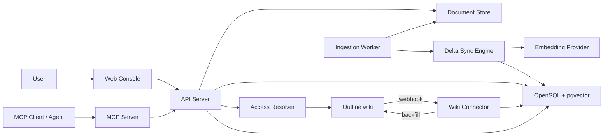
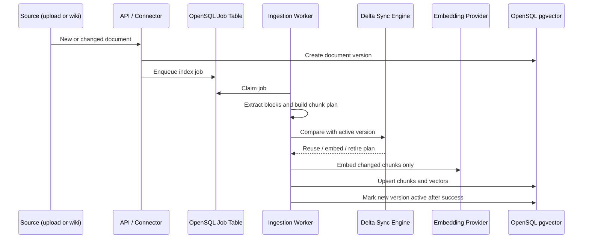

# OpenSQL AutoRAG Sync Architecture Design

> Updated to describe the system as built. Where the original design and the
> implementation diverged, this records what exists and why — the differences are
> called out in section 20. The task-by-task build order is a separate document,
> `docs/superpowers/plans/2026-07-04-opensql-autorag-sync-implementation.md`,
> which covers the original scope only and is kept as a record rather than
> maintained.

## 1. Direction

OpenSQL AutoRAG Sync is a product-led AI document search platform built around OpenSQL and pgvector. The user-facing story is simple: bring documents in, let the platform extract and index knowledge, then search the latest version through an MCP-compatible interface. The technical differentiator is the Delta Sync Engine, which detects changed document regions and re-embeds only affected chunks instead of rebuilding the whole vector index.

Documents arrive two ways: uploaded directly, or synchronised from an Outline wiki. The wiki is the case the delta engine exists for — an uploaded file changes when someone uploads it again, while a wiki is edited continuously by many people, and re-embedding a whole page on every typo is the cost the engine removes.

The selected architecture follows the contest direction while keeping the implementation focused enough for a polished submission:

- Primary story: OpenSQL as an operational AI document database.
- Core differentiator: changed-chunk synchronization and version-aware retrieval.
- Product surface: web console, ingestion API, wiki connector, background worker, retrieval API, and MCP server.
- Retrieval honours the permissions of the system a document came from, so indexing an internal wiki does not make it readable by everyone.
- Deployment stance: app services connect to OpenSQL through a standard PostgreSQL-compatible DSN; high availability can be demonstrated by pointing the same app at an OpenSQL HA endpoint such as OpenProxy.

## 2. Goals

- Upload PDF, DOCX, Markdown, and plain text documents.
- Keep an Outline wiki in sync, by webhook for immediacy and by scheduled backfill as the safety net.
- Extract text and preserve useful source metadata such as page, heading, section path, and version.
- Split text into semantic chunks using structure-aware rules rather than fixed character slicing.
- Generate embeddings with a configured model and validate the embedding setup before writing pgvector values.
- Store document metadata, versions, chunks, embeddings, sources, and sync runs in OpenSQL.
- Reprocess only changed chunks when a document version changes.
- Retrieve by meaning and by wording together, filtered by what the caller is allowed to read at the source.
- Provide retrieval through REST APIs and MCP tools.
- Show a product-quality demo flow: bring a document in, index, search, modify, delta-sync, search again.

## 3. Non-Goals

- Training or fine-tuning a language model.
- Building a full OCR pipeline for scanned PDFs in the first version.
- Automating OpenSQL Patroni, etcd, or OpenProxy cluster provisioning.
- Owning identity. The platform authenticates callers against Outline and reads their permissions from it; it does not define users, roles, or groups of its own, and it has no billing or tenant model. Access control over *uploaded* documents is outside this — they carry no source permissions to honour.
- Writing to the wiki. Synchronisation is one way, and the OAuth scope requested is `read`.
- Building a chatbot UI as the main product. The app should expose search and source grounding; any chat client can connect through MCP.

## 4. System Overview

The backend is split into small units with clear responsibilities:

- Web Console: sign in, upload documents, inspect versions and sync status, run searches.
- API Server: validates requests, creates document versions, enqueues indexing jobs, resolves the caller's scope, and exposes REST endpoints. Retrieval lives here rather than in a separate service, so the MCP server and the console cannot drift apart.
- Wiki Connector: receives Outline webhooks and runs backfills, writing documents and indexing jobs through the same repository the API uses.
- Document Store: keeps original files and fetched wiki bodies on local disk.
- Ingestion Worker: extracts text, chunks documents, runs delta planning, embeds required chunks, writes results.
- Delta Sync Engine: compares old and new chunk plans, decides which chunks can be reused, re-embedded, or retired.
- Embedding Provider: wraps the configured embedding model, reports vector dimension, and marks text by role.
- Access Resolver: turns a caller's Outline token into the set of collections they may read, cached briefly.
- OpenSQL Storage: source of truth for metadata, versions, chunks, vectors, sources, sessions, jobs, and logs.
- MCP Server: exposes retrieval tools to MCP-compatible clients, over the same search path as REST.

## 5. Technology Choices

- Backend: Python with FastAPI for REST APIs.
- Worker: Python process polling an OpenSQL-backed job table, avoiding a separate queue dependency for the contest version.
- Connector: FastAPI endpoint for webhooks plus a CLI entry point for backfill and preflight.
- MCP: Python MCP server process importing the same search module as the API.
- Frontend: React with Vite for a compact product console.
- Database: OpenSQL with pgvector. Local development may use PostgreSQL with pgvector only as a compatibility fallback when OpenSQL is not available.
- Text extraction: pypdf for PDFs, python-docx for DOCX, a Markdown reader that understands headings, and a plain reader for text. PyMuPDF was the original choice and reads PDFs better, but it is AGPL, which the project's own MIT licence cannot carry; pypdf is BSD and supplies both the page text and the bookmark tree this design depends on.
- Embedding: configurable provider with `intfloat/multilingual-e5-small` as the default contest model, loaded and run in-process. No document text or query leaves the host.
- Keyword retrieval: PostgreSQL full text search over a GIN expression index, with the text search configuration fixed to match the index.

The default embedding dimension is 384, so the first database schema uses `vector(384)`. The embedding dimension is treated as a schema and runtime contract. Startup validation compares the configured dimension, model output dimension, and OpenSQL vector column dimension before indexing begins.

Dimension agreement is necessary but not sufficient. Two providers can share a dimension — the offline hash provider and the default model are both 384 — so the API and MCP server additionally compare the model they are configured with against the models the stored vectors actually came from, and report a mismatch rather than returning an empty result with no explanation.

## 6. Data Model

Core tables:

- `documents`: logical document record, title, source type, current active version, `retired_at`.
- `document_versions`: immutable version snapshot, file hash, extracted text hash, status, created time.
- `document_sources`: where a document came from — system, external id, collection, external URL, last synced body hash, external updated time. Absent for uploads.
- `document_chunks`: chunk metadata, version, stable key, position, heading path, source page range, content hash, token estimate, active flag.
- `chunk_embeddings`: chunk id, embedding model id, vector value, vector hash, created time.
- `embedding_models`: provider, model name, dimension, distance metric, enabled flag.
- `index_jobs`: upload and sync job state, retry count, error message, timing.
- `sync_runs`: summary of each indexing run, counts for reused, embedded, retired, failed chunks.
- `oauth_logins`: a login in flight — state, PKCE verifier, where to return to, expiry.
- `oauth_sessions`: a signed-in caller — cookie digest, Outline user, encrypted access and refresh tokens, expiries.
- `query_logs`: query text, filters, top results, latency, selected model. Created by the schema but not yet written to by any code path.

Indexes that retrieval depends on:

- HNSW over `chunk_embeddings.embedding` with `vector_cosine_ops`.
- GIN over `to_tsvector(<config>, document_chunks.text)`, an expression index so it can be added to a populated table without rewriting it.

Retirement is recorded on `documents.retired_at` rather than by deactivating chunks alone. An indexing job queued before a removal would otherwise reactivate them on completion, so pending jobs are cancelled and completion honours the flag.

## 7. Ingestion Flow

The active version changes only after indexing succeeds. If extraction or embedding fails, the previous searchable version remains active.

## 8. Wiki Synchronization

An Outline document id is reused verbatim as the AutoRAG document id, so there is no mapping table and a re-sync lands as a new version of the same document.

Two paths, and the second is what makes the first safe to rely on:

- **Webhook.** Outline pushes document events to the connector, authenticated by an `Outline-Signature` HMAC over `{timestamp}.{body}`. Removal events — delete, permanent delete, archive, unpublish — retire the document. Everything else re-fetches and re-indexes it. A signature older than the tolerance is rejected, which bounds replay.
- **Backfill.** A scheduled full pass that ingests changed bodies and retires documents the wiki no longer lists. This is how a missed delivery is recovered, and it is skipped when any document failed to fetch, because an incomplete listing is not evidence that the missing documents are gone.

An unchanged body still refreshes source metadata: moving a document between collections changes nothing in its text, and the collection is what permissions filter on.

## 9. Semantic Chunking

The chunker is deterministic and structure-aware. A chunk is a section rather than a fixed slice, which is what gives a result its context and what lets delta sync re-embed one edited section.

Structure comes from whatever signal the format actually carries, rather than from a guess:

| Format   | Heading signal            | Granularity    |
|----------|---------------------------|----------------|
| Markdown | ATX and setext headings   | line           |
| DOCX     | Heading paragraph styles  | paragraph      |
| PDF      | Bookmarks, when present   | page           |
| Text     | none                      | whole document |

A PDF has no reliable inline heading marker — a heading there is a visual weight, not a structure — so the bookmark tree is the only outline trusted, and a file without one keeps page-level division.

Chunk assembly runs in three passes: collect sections, merge the thin ones, split the long ones. Whether a section deserves a chunk of its own depends on the size of the one beside it, which cannot be known while streaming blocks.

- Sections under `min_tokens` fold into a neighbour; one at the end folds backwards. Splitting purely at headings otherwise yields eight-word chunks, which carry too little for a query to tell apart.
- Merging is skipped where it would push a chunk past the target size.
- A merged chunk is labelled with the deepest heading its sections share, so it never claims to be the one section it is least about.
- Overlap applies only inside a section. Carried across a boundary it opens a chunk with the previous section's words under the new section's heading, and couples the two so editing either re-embeds both.
- `stable_key` comes from document identity, heading path, chunk order, and content; whitespace is normalised before hashing.

## 10. Delta Sync Engine

The engine compares the previous active version with the new candidate version and plans each chunk.

Planning rules, as implemented:

- A chunk whose content hash appears in the previous version reuses that embedding. Matching is on content alone, so a section that moved within a document is still reused.
- A chunk with no previous match is embedded.
- A previous chunk with no match in the new version is retired — marked inactive rather than deleted, so a page that comes back reuses its stored vectors.

The original design also called for re-embedding a window around a changed chunk boundary. Structure-aware chunking makes that unnecessary in the common case: a boundary is a heading, so an edit stays inside one section. Where a long section does split into overlapping windows, an edit shifts the windows after it and their content hashes change, so the same effect falls out of hashing.

The demo exposes the engine's value directly: after editing one section of a wiki page, the sync run reports the other sections reused and one embedded.

## 11. Retrieval and Ranking

Retrieval has two arms, and a request selects between them with `mode`.

- **Vector.** The query is embedded with the configured model and compared by cosine distance against active chunks. Because the model is asymmetric, the query is marked `query` and indexed content is marked `passage`; the role comes from the caller, never inferred from the text.
- **Keyword.** PostgreSQL full text search over the same chunks. This is what carries identifiers, error strings, and product names — tokens an embedding blurs into whatever they resemble. Terms are combined with OR and ranked by `ts_rank_cd`, because requiring every term discards a match over one absent word, which for conversational queries is most of them.
- **Hybrid**, the default, runs both and fuses by reciprocal rank. Fusion is on rank rather than score: cosine similarity sits near 1 for anything topical while `ts_rank_cd` is unbounded, so combining the numbers directly would need a calibration that changes with every corpus. Each arm contributes more candidates than `top_k`, since fusion can only rank what it is given.

A hybrid result reports which arms matched it and what each scored, because the fused score is a rank statistic and no longer a similarity.

Vector search reads through an HNSW index, which visits a bounded candidate pool. Since the permission filter can reject most of that pool, iterative scan is enabled on every connection so the scan resumes rather than returning fewer results than exist.

## 12. Permissions

Search honours the permissions of the system a document came from, by asking that system rather than by modelling them here.

- A caller arrives with an Outline access token — from signing in through the console, or presented directly as a header by a machine caller. The API resolves it to the collections that token can read, cached for a short window.
- The filter is applied inside the search SQL, not to its results, so a document out of scope cannot consume one of the `top_k` slots.
- A document synced from a source is reachable only through a collection the caller can read. One whose collection is unknown is reachable by nobody, never public by default.
- A document uploaded directly has no source permissions to honour and is governed by a separate flag, which is on for every caller. Uploads are therefore visible to anyone who can reach the API — the asymmetry is deliberate but is the platform's sharpest edge.
- Titles are content: `list_documents` and `get_chunk_context` are scoped the same way, and a chunk id is not a capability.

Signing in uses Outline's OAuth authorization code flow with PKCE and a required state, both held server side. Sessions live in the database, the cookie is stored as a digest, and Outline tokens are encrypted at rest with a key derived from the session secret. Signing out revokes the token at Outline as well as dropping the session.

## 13. MCP Interface

The MCP server exposes the retrieval layer as tools:

- `search_documents`: search across active document chunks, with the same `mode` the REST API takes.
- `get_chunk_context`: fetch a selected chunk with neighboring chunks and source metadata.
- `list_documents`: list indexed documents and active versions.
- `get_sync_status`: inspect the latest indexing or delta-sync run.

The server does not duplicate retrieval logic; it calls the same module the REST endpoint does, so the two cannot answer differently. It speaks stdio to a single user, so that user's Outline token comes from configuration rather than from a request, and without one only uploaded documents are in scope.

Anything a caller needs in order to interpret an empty answer travels in the tool result rather than a server log, since an agent cannot read one.

## 14. Web Console

A single page, with a sidebar for identity and actions and two panels:

- **Documents**: indexed documents with type, active chunk count, whether they were removed at source, and a control to upload a new version of any of them.
- **Search**: a query box and results showing the fused score, which arms matched, the heading path, the source link back to the wiki, and the version.

The sidebar carries sign-in and sign-out, the document count, and a statement of what the current identity can see — the console says plainly when results are limited to uploaded documents because nobody is signed in.

The UI presents OpenSQL as the central storage and retrieval engine, not as a hidden implementation detail.

## 15. Error Handling

- File validation errors return immediately from the API.
- Extraction failures mark the job failed and keep the previous active version.
- Vector dimension mismatches fail fast in the worker before any chunk writes.
- An embedding model that has nothing indexed under it is reported at API startup and on any empty search, because that case is otherwise indistinguishable from a query with no matches.
- A webhook with a missing, malformed, stale, or wrong signature is rejected with 401 and nothing is written.
- Partial indexing results are written under a non-active version until the run completes.
- Job logs keep enough detail for the demo: stage, elapsed time, counts, and failure reason.

## 16. Testing Strategy

- Unit tests for chunk normalization, stable key generation, section merging, and chunk windowing.
- Unit tests for delta planning: unchanged, inserted paragraph, edited paragraph, deleted section.
- Unit tests for extraction per format, including headings inside code fences and documents without bookmarks.
- Unit tests for embedding role and dimension validation.
- Database-backed tests for anything expressed in SQL. The permission filter and both retrieval arms run against a real database, because a filter that is wrong in a way Python cannot see is the failure worth catching; they skip rather than fail when no database is reachable.
- MCP contract tests for tool names, argument schemas, and response shape.
- A disposable self-hosted Outline stack under `--profile outline`, so the connector, the permission filter, and the sign-in flow can be exercised against a real instance rather than against mocked responses.

## 17. Demo Script

1. Bring in a document — upload one, or show a wiki page already synced.
2. Show automatic extraction, semantic chunking, embedding, and pgvector indexing.
3. Search through the Web Console and through an MCP client.
4. Sign in as a second account with narrower wiki access and run the same search, showing the results it does not get.
5. Modify one section of the document at its source.
6. Show Delta Sync results: the other sections reused, one embedded.
7. Search again and show that the answer reflects the latest version with source metadata.
8. Explain that the same app can point to an OpenSQL HA endpoint for operational deployment.

## 18. Implementation Boundaries

The build is a single repository with these top-level areas:

- `apps/web`: React product console.
- `services/api`: FastAPI server, retrieval, sessions, and access resolution.
- `services/worker`: ingestion and delta-sync worker, and the format extractors.
- `services/connector`: Outline webhook receiver, backfill, and preflight.
- `services/mcp`: MCP server.
- `packages/core`: shared domain models, chunking, delta planning, embeddings.
- `infra`: Docker Compose, database initialization, the OpenSQL image, and the Outline test stack.
- `docs`: architecture, demo, and operation notes.

This gives the project a product shape without scattering logic across too many services.

## 19. Known Risks

- OpenSQL availability for local development may require a fallback PostgreSQL + pgvector compose profile.
- Changing the embedding model, the chunking rules, or the embedding role invalidates stored vectors. Delta sync reuses by content hash, so a re-sync alone will hand the old vectors back; the vectors have to be dropped first.
- PDF extraction quality varies; scanned PDFs are unsupported unless OCR is added later, and a PDF without bookmarks gets page-level structure only.
- The keyword arm's text search configuration must match the index it reads; changing one means rebuilding the other.
- A filtered vector search depends on pgvector 0.8 iterative scans to fill `top_k` on a large index. Older pgvector works but can return fewer results than exist.
- Permissions are enforced per collection, not per document, and a revoked membership keeps working until the access cache expires.
- HA is positioned accurately: the app supports connecting through OpenSQL HA infrastructure, but the project does not provision the HA cluster itself.

## 20. Changes From the Original Design

Recorded so the two documents can be read together.

- **Wiki synchronisation and permissions were not in the original scope.** The original listed "enterprise auth and multi-tenant RBAC" as a non-goal, which is still true of identities this platform would own; what exists instead is delegation to Outline for both authentication and read permissions.
- **Hybrid search moved from extension point to default.** The original described keyword search and merging as designed but deferred. Both exist; the merge is reciprocal rank fusion.
- **Retrieval is not a separate service.** It lives in `services/api` and the MCP server imports it, which is what the original asked for behaviourally — one implementation, two surfaces — without a fourth process.
- **The delta boundary-window rule was dropped**, for the reason given in section 10.
- **The console is one page, not four screens.** Sync detail is shown as a per-document chunk count and a removal marker rather than a dedicated screen.
- **Chunking gained a minimum section size.** Splitting at headings alone produced chunks too small to retrieve.
- **`query_logs` was never wired up.** The table is in the schema and nothing writes to it, so search analytics are still unbuilt rather than partly built.
- **PDF extraction moved from PyMuPDF to pypdf**, because the project is MIT licensed and PyMuPDF is AGPL. It costs some extraction quality on awkward PDFs and buys a licence the project can actually offer.
